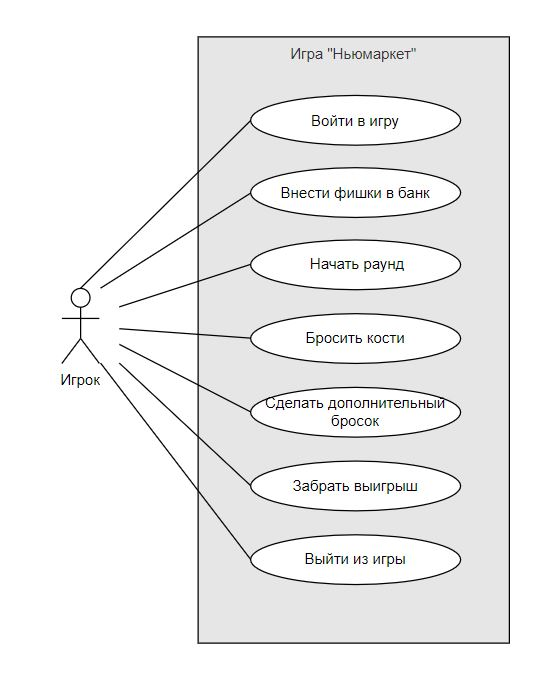

# Лабораторная работа №1
## Игра "Ньюмаркет"

*Use case diagram*

## Прецендент "Войти в игру"

| Прецедент | Войти в игру |
|---|---|
| Основной исполнитель | Игрок |
| Описание | Игрок вводит имя |
| Предусловия | Игрок подключен к системы, данные игрока еще не известны |
| Постусловия | Данные игрока сохранены, игроку выдана определенная сумма фишек |

**Основной сценарий:**

| Действия актора | Реакция системы |
|---|---|
|1. Поключается к системе||
||2. Запрашивает у игрока ввод его имени|
|3. Вводит свое имя ||
||4. Проверяет заполнил ли игрок поле ввода имени|
||5. Сохраняет данные игрока|
||5. Выдает определенную сумму фишек|

**Альтернативный сценарий:**

Игрок не заполняет поле ввода имени

>   Система уведомляет игрока о неккоректном вводе данных и просит ввести их повторно

 ## Прецендент "Внести фишки в банк"

| Прецедент | Внести фишки в банк |
|---|---|
| Основной исполнитель | Игрок |
| Описание | Игрок вводит сумму фишек, которые он ставит на кон|
| Предусловия | Игрок авторизирован, ему на баланс зачислена определенная сумма фишек |
| Постусловия | С баланса игрока в общий банк переходит указанное количество фишек. Игрок готов к началу игры |

**Основной сценарий:**

| Действия актора | Реакция системы |
|---|---|
|1. Игрок вводит сумму фишек, которые он ставит на кон||
||2. Проверяет корректность введенных данных |
||3. Сохраняет введенные данные |
||4. Снимает введенную сумму с счета игрока |
||5. Добавляет эту сумму в общий банк |

**Альтернативные сценарии:**

Игрок не заполняет поле ввода суммы. 

Игрок заполняет поле ввода суммы неккоректно (вводит сумму больше, чем у него сейчас на счету или вводит не число)

>  Система уведомляет игрока о неккоректном вводе данных и просит ввести их повторно

 ## Прецендент "Начать раунд"
 
| Прецедент | Начать раунд |
|---|---|
| Основной исполнитель | Игрок |
| Описание | Игрок готов начать игру и уведомляет систему об этом|
| Предусловия | Игрок ввел имя и сделал ставку |
| Постусловия | Игра начинается |

**Основной сценарий:**

| Действия актора | Реакция системы |
|---|---|
|1. Соглашается начать игру||
||2. Подключает игрока к игре|
||3. Запускает игру|

 ## Прецендент "Бросить кости"
 
| Прецедент | Бросить кости |
|---|---|
| Основной исполнитель | Игрок |
| Описание | Игрок бросает кости |
| Предусловия | Игрок присутствует в комнате игры, игра начата, ход предоставлен данному игроку |
| Постусловия | На столе остается кость с наибольшим значением. Количество очков игрока увеличивается на это значение |

**Основной сценарий:**

| Действия актора | Реакция системы |
|---|---|
|1. Бросает 3 кости||
||2. Отображает значения, которые выпали на костях|
||3. Оставляет на столе только, кость с наибольшим значением |
||4. Увеличивает количество очков игрока на это значение |

**Альтернативные сценарии:**

Игрок уже 1 раз бросил кости.

>   Данный прецедент реализуется по тому же сценарию, но игрок бросает 2 кости

Игрок уже 2 раза бросил кости.

>   Данный прецедент реализуется по тому же сценарию, но игрок бросает 1 кость

Игрок уже 3 раза бросил кости.

>   Ход переходит к другому игроку

## Прецендент "Сделать дополнительный бросок"
 
| Прецедент | Сделать дополнительный бросок |
|---|---|
| Основной исполнитель | Игрок |
| Описание | Игрок делает дополнительный бросок, так как в результате раунда произошла ничья
| Предусловия | Каждый игрок 3 раза бросил кости, как минимум, у двух игроков совпала сумма очков |
| Постусловия | Определяется победитель |

**Основной сценарий:**

| Действия актора | Реакция системы |
|---|---|
|1. Бросает одну кость||
||2. Отображает значения, которые выпали на костях|
||3. Увеличивает количество очков игрока на это значение |
||4. Передает ход другому игроку |
||5. После его хода выявляет победителя |

Игрокам опять выпало одинаковое значение.

>   Игроки делают дополнительный бросок по тому же сценарию

## Прецендент "Забрать выигрыш"
 
| Прецедент | Забрать выигрыш |
|---|---|
| Основной исполнитель | Игрок |
| Описание | Игрок хочет забрать свой выигрыш и не хочет продолжать игру
| Предусловия | Каждый игрок сделал свой ход, система выявила победителя |
| Постусловия | Счет игрока увеличивается на сумму, которая была в общем счете банка. Игра заканчивается |

**Основной сценарий:**

| Действия актора | Реакция системы |
|---|---|
|1. Игрок соглашается забрать выигрыш||
||2. Увеличивает счет игрока на сумму, которая была в общем счете банка|
||3. Обнуляет счет банка|
||4. Заканчивает игру|

## Прецендент "Выйти из игры"
 
| Прецедент | Выйти из игры |
|---|---|
| Основной исполнитель | Игрок |
| Описание | Игрок хочет забрать завершить игру
| Предусловия | Раунд начат, игрок находится в игре|
| Постусловия | Игра завершена, игрок вышел из игры |

**Основной сценарий:**

| Действия актора | Реакция системы |
|---|---|
|1. Игрок выходит из игры||
||2. Уведомляет других игроков, что игрок покинул игру|
||3. Сумму, находящуюся в банке делит на оставшихся количество игроков|
||4. Увеличивает счета оставшихся игроков на эту сумму|
||5. Завершает игру|
