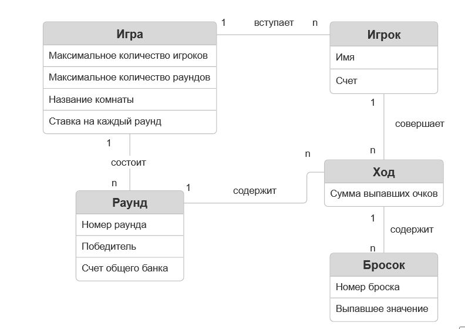

# Лабораторная работа №2
## Игра "Ньюмаркет"

*ERD diagram*

## Игра
> Пользователь создает игру.
>
> Для создания игры пользователю нужно указать максимальное количество игроков, максимально количество раундов, ставку на каждый раунд и название комнаты для игры.
>

## Игра - Игрок
> Игроки вступают в игру, при этом указываю свое имя.
> 
> Так же каждому игроку выдается определенное количество фишек, которое фиксируется у него на счету. После проигрышей или выигрышей данное число может уменьшаться или увеличиваться соответственнно.
> 
> Пользователь вступает только 1 игру в реальном времени. Игра может содержать некоторое количество игроков.

## Игрок - Ход
>  Игрок совершает ход.
> 
> В характеристика ход указывается сумма выпавших очков за 3 броска
>
> Игрок за игру может совершить несколько ходов. Но определенный ход совершается только одним игроком.

## Ход - Бросок
>  Ход состоит из бросков.
> 
> В характеристика броска указывается его порядковый номер:
> * 1 бросок - игрок кидает 3 кости
> * 2 бросок - игрок кидает 2 кости
> * 3 бросок - игрок кидает 1 кость
>
> Так же в характеристиках броска указывается выпавшее на кости значение. Для этого из лежащих на столе костей выбирается наибольшее.
>   
> Ход состоит из 3 бросков. Определенный бросок принадлежит только одному ходу.

## Ход - Раунд
>  Раунды состоят из ходов игроков.
>
> В характеристиках раунда указывается его порядковый номер. В характеристиках раунда так же указывается победитель раунда
>
> Раунд состоит из нескольких ходов. Определенный ход принадлежит только одному раунду

## Игра - Раунд
>  Игра состоит из раундов.
>
> В характеристиках раунда указан счет общего банка, его формирование описано нижу под названием "Ставки"
> 
> Игра состоит из нескольких раундов. Определенный раунд принадлежит только одной игре

## Ставки
> Перед началом игры пользователь указывает ставку на каждый раунд. То есть это та сумма фишек, которая перед каждым раундом будет сниматься с счетов игроков и перходить в общий счет банка,
> хранящийся в характеристиках раунда. После завершения раунда, выявляется победитель на счет, которого переходит общий счет банка.
> Ставка на раунд хранится именно в характеристиках игры, потому что она неизменна на протяжении всей игры.
> Общий счет банка хранится именно в характеристиках раунда, так как он может меняться от раунда к раунду. Из-за того, что игроки с нулевым счетом будет выбывать из игры.
