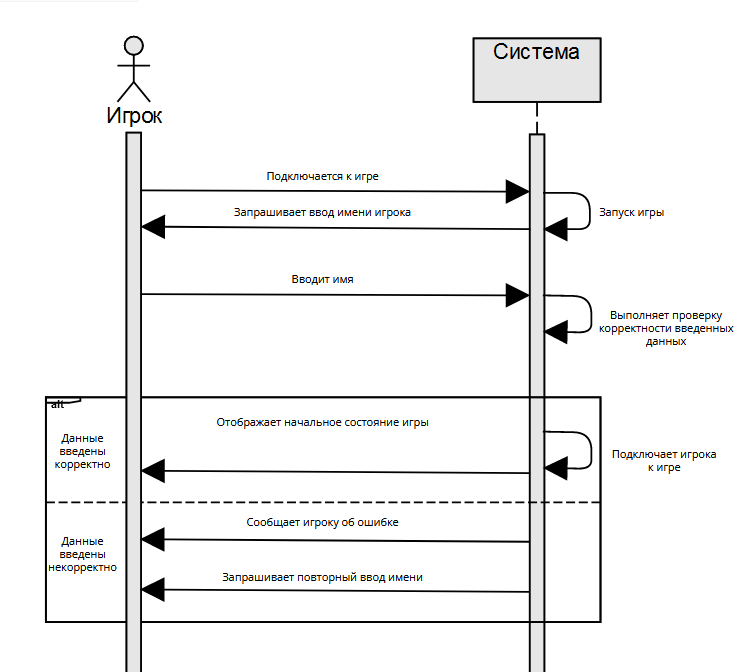
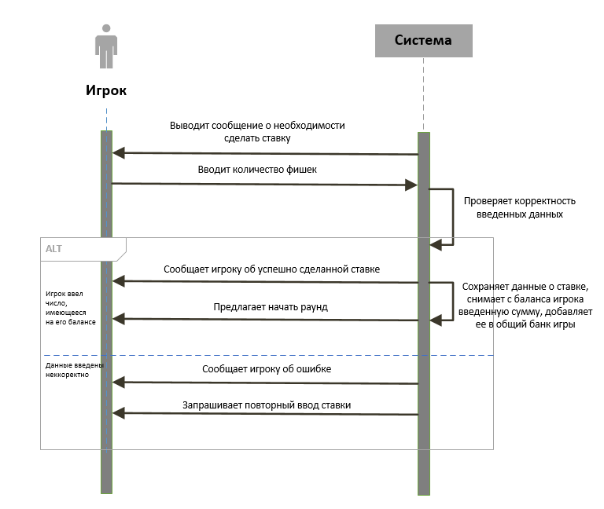
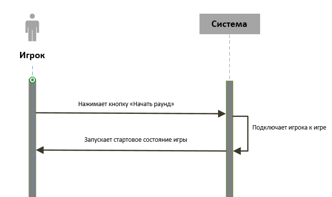
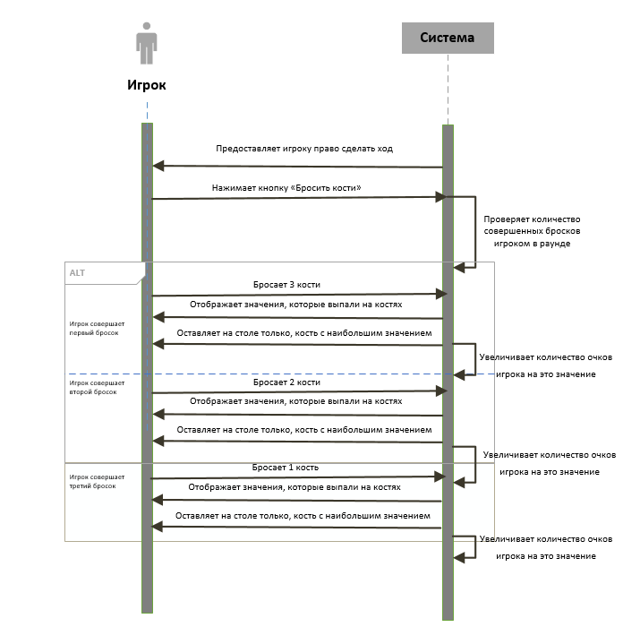
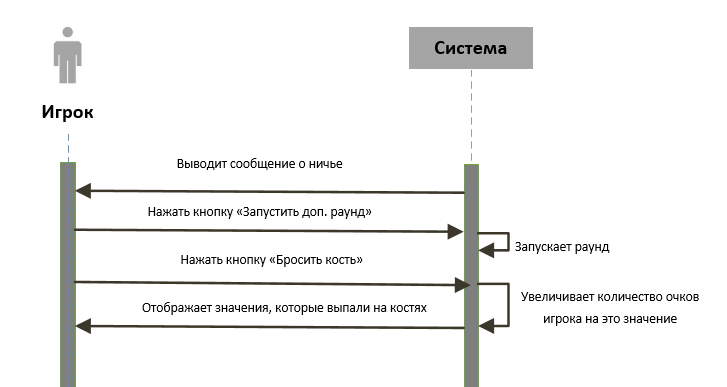
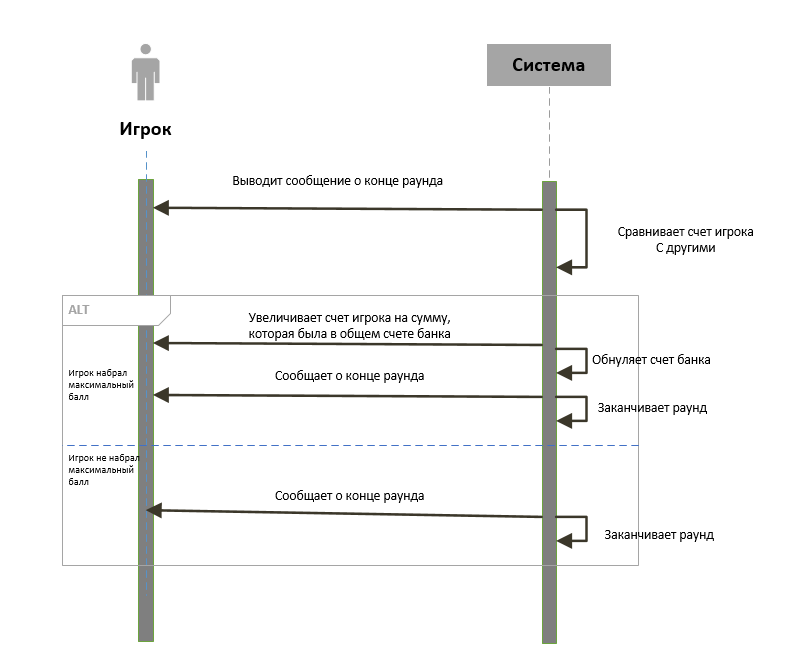
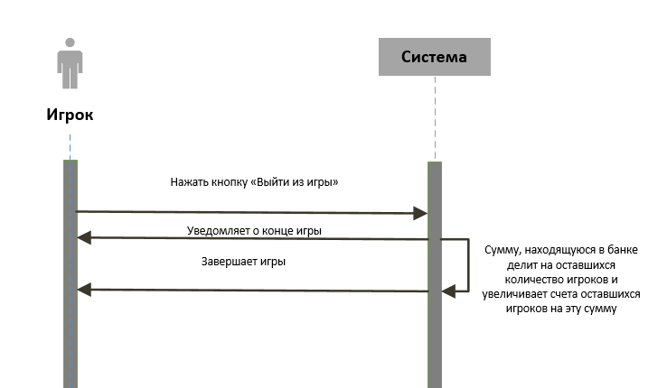

# Лабораторная работа №3
## Игра "Ньюмаркет"

*Системные диаграммы последовательностей*

## Прецедент "Войти в игру"

Операция | Подключается к игре
:-----------------------|-----------------------:
Ссылки | Прецеденты: Войти в игру
Предусловия | Пользователь решил подключиться к игре
Постусловия | Система получает запрос на запуск игры

Операция | Запуск игры
:-----------------------|-----------------------:
Ссылки | Прецеденты: Войти в игру
Предусловия | Пользователь отправил запрос на запуск игры
Постусловия | Игра запущена

Операция | Запрашивает ввод имени игрока
:-----------------------|-----------------------:
Ссылки | Прецеденты: Войти в игру
Предусловия | Система запущена
Постусловия | Игроку предоставлен интерфейс для ввода имени

Операция | Вводит имя
:-----------------------|-----------------------:
Ссылки | Прецеденты: Войти в игру
Предусловия | Система предоставила интерфейс для ввода имени
Постусловия | Получены данные о имени игрока

Операция | Выполняет проверку корректности введенных данных
:-----------------------|-----------------------:
Ссылки | Прецеденты: Войти в игру
Предусловия | Игрок ввел данные о своем имени
Постусловия | Получен результат проверки данных

Операция | Подключает игрока к игре
:-----------------------|-----------------------:
Ссылки | Прецеденты: Войти в игру
Предусловия | Игрок корректно ввел данные о своем именни
Постусловия | Игроку предоставлен интерфейс для дальнейшего взаимедействия с системой

Операция | Отображает начальное состояние игры
:-----------------------|-----------------------:
Ссылки | Прецеденты: Войти в игру
Предусловия | Игрок подключен к игре
Постусловия | Игра начинается

Операция | Сообщает игроку об ошибке
:-----------------------|-----------------------:
Ссылки | Прецеденты: Войти в игру
Предусловия | Игрок ввел некорректные данные о своем имени
Постусловия | Игрок получил сообщение о неккоректной вводе данных

Операция | Запрашивает повторный вход
:-----------------------|-----------------------:
Ссылки | Прецеденты: Войти в игру
Предусловия | Игрок получил сообщение о неккоректной вводе данных
Постусловия | Игроку предоставлен интерфейс для повторного ввода данных
___

## Прецедент "Внести фишки в банк"

Операция | Выводит сообщение о необходимости сделать ставку
:-----------------------|-----------------------:
Ссылки | Прецеденты: Внести фишки в банк
Предусловия | Игрок подключен к игре
Постусловия | Игроку предоставлен интерфейс для ввода данных

Операция | Вводит количество фишек
:-----------------------|-----------------------:
Ссылки | Прецеденты: Внести фишки в банк
Предусловия | Игроку предоставлен интерфейс для ввода данных
Постусловия | Получает данных о количестве внесенных фишек

Операция | Проверяет корректность введенных данных
:-----------------------|-----------------------:
Ссылки | Прецеденты: Внести фишки в банк
Предусловия | Игрок ввел данные о своем количестве внесенных фишек
Постусловия | Получен результат проверки данных

Операция | Сообщает игроку об успешно сделанной ставке
:-----------------------|-----------------------:
Ссылки | Прецеденты: Внести фишки в банк
Предусловия | Игрок корректно ввел данные
Постусловия | Получены корректные данные о ставке

Операция | Сохраняет данные о ставке, снимает с баланса игрока введенную сумму, добавляет ее в общий банк игры
:-----------------------|-----------------------:
Ссылки | Прецеденты: Внести фишки в банк
Предусловия | Система получила корректные данные о внесенном количестве фишек
Постусловия | Сохранены данные о ставке

Операция | Предлагает начать раунд
:-----------------------|-----------------------:
Ссылки | Прецеденты: Внести фишки в банк
Предусловия | Сохранены данные о ставке
Постусловия | Игроку предоставлен интерфейс для начала раунда

Операция | Сообщает игроку об ошибке
:-----------------------|-----------------------:
Ссылки | Прецеденты: Войти в игру
Предусловия | Игрок ввел некорректные данные о количестве внесенных фишек
Постусловия | Игрок получил сообщение о неккоректной вводе данных

Операция | Запрашивает повторный вход
:-----------------------|-----------------------:
Ссылки | Прецеденты: Войти в игру
Предусловия | Игрок получил сообщение о неккоректной вводе данных
Постусловия | Игроку предоставлен интерфейс для повторного ввода данных
___

## Прецедент "Начать раунд"

Операция | Нажимает кнопку "Начать раунд"
:-----------------------|-----------------------:
Ссылки | Прецеденты: Начать раунд
Предусловия | Игроку предоставлен интерфейс для начала раунда
Постусловия | Нажата кнопка "Начать раунд"

Операция | Подключает игрока к раунду
:-----------------------|-----------------------:
Ссылки | Прецеденты: Начать раунд
Предусловия | Нажата кнопка "Начать раунд"
Постусловия | Игрок подключен к раунду

Операция | Запускает стартовое состояние раунда
:-----------------------|-----------------------:
Ссылки | Прецеденты: Начать раунд
Предусловия | Игрок подключен к раунду
Постусловия | Игрок начинает играть
___

## Прецедент "Бросить кости"

Операция | Предоставляет игроку право сделать ход
:-----------------------|-----------------------:
Ссылки | Прецеденты: Бросить кости
Предусловия | Игрок начал игру, подошла его очередь делать ход
Постусловия | Игроку предоставлен интерфейс для бросания костей

Операция | Нажимает кнопку "Бросить кости"
:-----------------------|-----------------------:
Ссылки | Прецеденты: Бросить кости
Предусловия | Игроку предоставлен интерфейс для бросания костей
Постусловия | Система получает запрос на бросание костей

Операция | Проверяет количество совершенных бросков игроком в раунде
:-----------------------|-----------------------:
Ссылки | Прецеденты: Бросить кости
Предусловия | Получен запрос на бросание костей
Постусловия | Определенно количество сделанных игроком бросков в этом раунде

Операция | Бросает 3 кости
:-----------------------|-----------------------:
Ссылки | Прецеденты: Бросить кости
Предусловия | Игрок совершает первый бросок
Постусловия | Система получает данные о 3 выпавших значениях

Операция | Отображает значения, которые выпали на костях
:-----------------------|-----------------------:
Ссылки | Прецеденты: Бросить кости
Предусловия | Система получает данные о 3 выпавших значениях
Постусловия | Выбирается кость с наибольшем значением

Операция | Оставляет на столе только кость с наибольшем значением
:-----------------------|-----------------------:
Ссылки | Прецеденты: Бросить кости
Предусловия | Выбирается кость с наибольшем значением
Постусловия | Сохранены данные о количестве полученных очков в этом раунде

Операция | Увеличивает количество очков игрока на наибольшее значение
:-----------------------|-----------------------:
Ссылки | Прецеденты: Бросить кости
Предусловия | Сохранены данные о количестве полученных очков в этом раунде
Постусловия | Счет игрока увеличен

Операция | Бросает 2 кости
:-----------------------|-----------------------:
Ссылки | Прецеденты: Бросить кости
Предусловия | Игрок совершает второй бросок
Постусловия | Система получает данные о 2 выпавших значениях

Операция | Отображает значения, которые выпали на костях
:-----------------------|-----------------------:
Ссылки | Прецеденты: Бросить кости
Предусловия | Система получает данные о 2 выпавших значениях
Постусловия | Выбирается кость с наибольшем значением

Операция | Оставляет на столе только кость с наибольшем значением
:-----------------------|-----------------------:
Ссылки | Прецеденты: Бросить кости
Предусловия | Выбирается кость с наибольшем значением
Постусловия | Сохранены данные о количестве полученных очков в этом раунде

Операция | Увеличивает количество очков игрока на наибольшее значение
:-----------------------|-----------------------:
Ссылки | Прецеденты: Бросить кости
Предусловия | Сохранены данные о количестве полученных очков в этом раунде
Постусловия | Счет игрока увеличен

Операция | Бросает 1 кость
:-----------------------|-----------------------:
Ссылки | Прецеденты: Бросить кости
Предусловия | Игрок совершает третий бросок
Постусловия | Система получает данные о 1 выпавшем значение

Операция | Отображает значения, которые выпали на костях
:-----------------------|-----------------------:
Ссылки | Прецеденты: Бросить кости
Предусловия | Система получает данные о 1 выпавшем значение
Постусловия | Выбирается кость с наибольшем значением

Операция | Оставляет на столе только кость с наибольшем значением
:-----------------------|-----------------------:
Ссылки | Прецеденты: Бросить кости
Предусловия | Выбирается кость с наибольшем значением
Постусловия | Сохранены данные о количестве полученных очков в этом раунде

Операция | Увеличивает количество очков игрока на наибольшее значение
:-----------------------|-----------------------:
Ссылки | Прецеденты: Бросить кости
Предусловия | Сохранены данные о количестве полученных очков в этом раунде
Постусловия | Счет игрока увеличен

___

## Прецедент "Сделать дополнительный бросок"

Операция | Выводит сообщение о ничье
:-----------------------|-----------------------:
Ссылки | Прецеденты: Сделать дополнительный бросок
Предусловия | По завершению раунда у нескольких игроков одинаковое число очков
Постусловия | Игрок получил интерфейс о начале доп. раунда

Операция | Нажать кнопку "Запустить доп. раунд"
:-----------------------|-----------------------:
Ссылки | Прецеденты: Сделать дополнительный бросок
Предусловия | Игрок уведомлен о необходимости проведения доп. раунда
Постусловия | Система получает запрос о начале доп. раунда

Операция | Запускает раунд
:-----------------------|-----------------------:
Ссылки | Прецеденты: Сделать дополнительный бросок
Предусловия | Был получен запрос о начале доп. раунда
Постусловия | Раунд начат

Операция | Нажимает кнопку "Бросить кости"
:-----------------------|-----------------------:
Ссылки | Прецеденты: Сделать дополнительный бросок
Предусловия | Раунд был начат
Постусловия | Получено значение выпавшее на кости

Операция | Увеличивает количество очков игрока на это значение
:-----------------------|-----------------------:
Ссылки | Прецеденты: Сделать дополнительный бросок
Предусловия | Получено значение выпавшее на кости
Постусловия | Счет игрока был изменен

Операция | Отображает значение, которое выпало на кости
:-----------------------|-----------------------:
Ссылки | Прецеденты: Сделать дополнительный бросок
Предусловия | Получено значение выпавшее на кости
Постусловия | После хода другого игрока будет определен победитель с наибольшим счетом
___

## Прецедент "Забрать выигрыш"

Операция | Выводит сообщение о конце раунда
:-----------------------|-----------------------:
Ссылки | Прецеденты: Забрать выигрыш
Предусловия | Все игроки сделали свои ходы
Постусловия | Раунд закончен

Операция | Сравнивает счет игрока с другими
:-----------------------|-----------------------:
Ссылки | Прецеденты: Забрать выигрыш
Предусловия | Раунд закончен
Постусловия | Выявлен победитель

Операция | Увеличивает счет игрока на сумму, которая была в общем счете банка
:-----------------------|-----------------------:
Ссылки | Прецеденты: Забрать выигрыш
Предусловия | Игрок стал победителем
Постусловия | Счет игрока изменен

Операция | Обнуляет счет банка
:-----------------------|-----------------------:
Ссылки | Прецеденты: Забрать выигрыш
Предусловия | Счет игрока изменен
Постусловия | Счет банка стал равен нулю

Операция | Сообщает о конце раунда
:-----------------------|-----------------------:
Ссылки | Прецеденты: Забрать выигрыш
Предусловия | Победитель награжден
Постусловия | Игра закончена

Операция | Сообщает о конце раунда
:-----------------------|-----------------------:
Ссылки | Прецеденты: Забрать выигрыш
Предусловия | Игрок не стал победителем
Постусловия | Игра закончено

___

## Прецедент "Выйти из игры"

Операция | Нажать кнопку "Выйти из игры"
:-----------------------|-----------------------:
Ссылки | Прецеденты: Выйти из игры
Предусловия | Игрок принял решение выйти из игры
Постусловия | Система получила запрос на выход из игры

Операция | Уведомляет о конце игры
:-----------------------|-----------------------:
Ссылки | Прецеденты: Выйти из игры
Предусловия | Система получила запрос на выход из игры
Постусловия | Все игроки уведомлены о конце игры

Операция | Сумму, находящуюся в банке, делит на оставшихся игроков и увеличивает счета оставшихся игроков на эту сумму
:-----------------------|-----------------------:
Ссылки | Прецеденты: Выйти из игры
Предусловия | Система получила запрос на выход из игры
Постусловия | Счет банка обнулен, счета игроков изменены

Операция | Завершает игру
:-----------------------|-----------------------:
Ссылки | Прецеденты: Выйти из игры
Предусловия | Счет банка обнулен
Постусловия | Игра завершена

Операция | Сообщает о конце раунда
:-----------------------|-----------------------:
Ссылки | Прецеденты: Забрать выигрыш
Предусловия | Победитель награжден
Постусловия | Игра закончена
