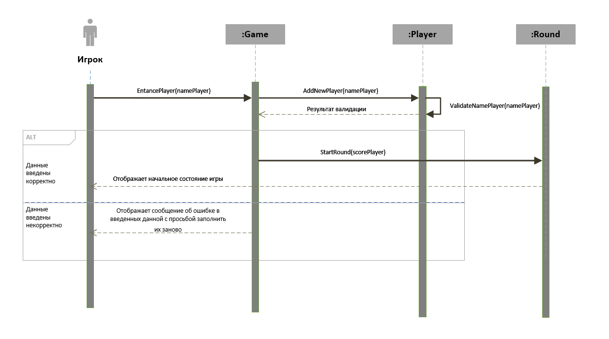
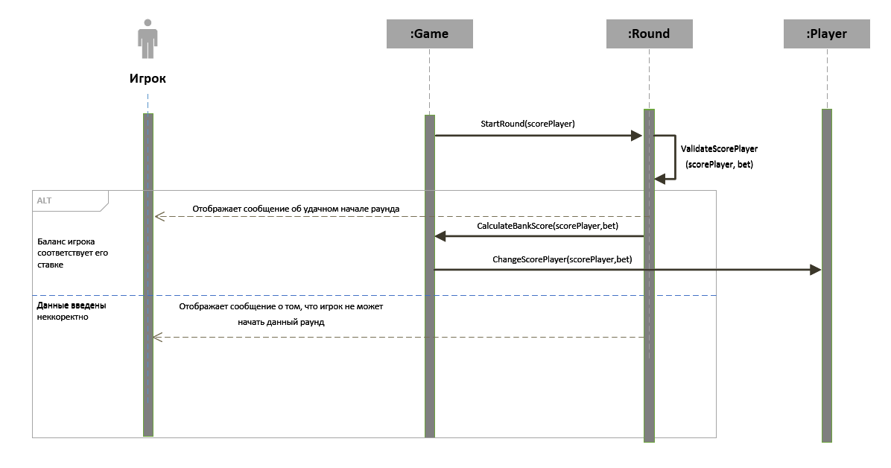
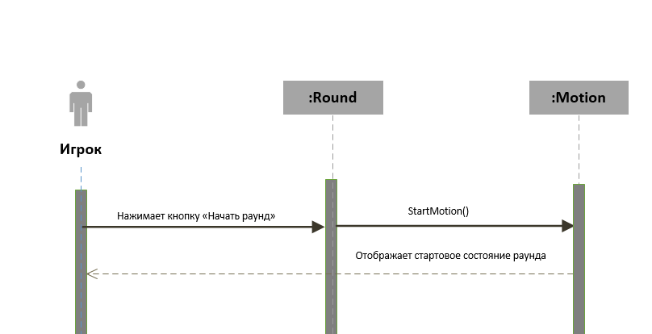
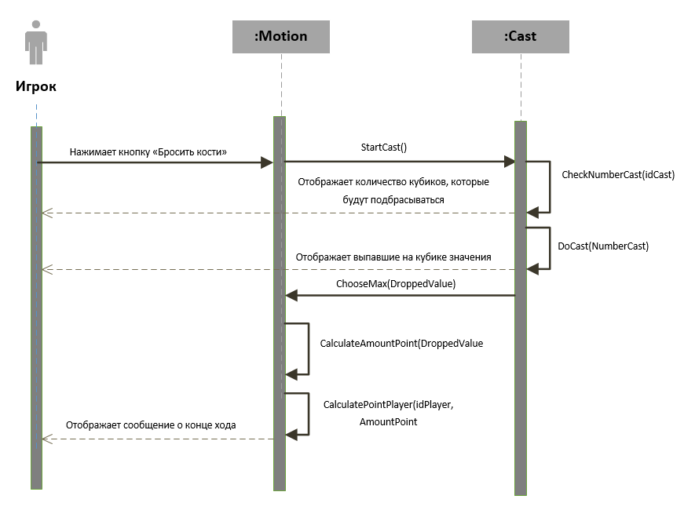
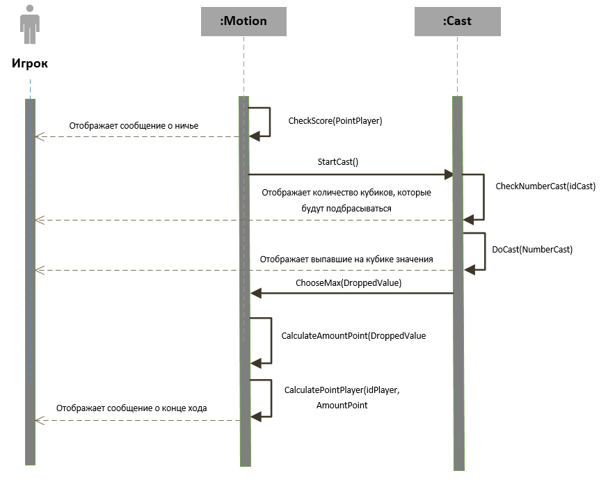
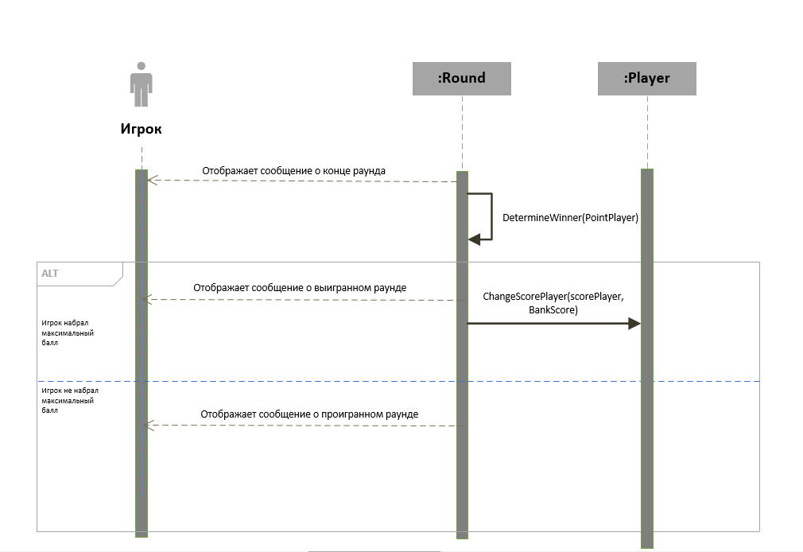
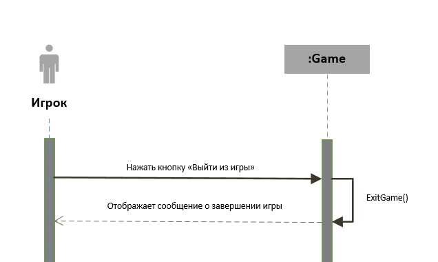

# Лабораторная работа №4
## Игра "Ньюмаркет"

*Системные диаграммы последовательностей внутри системы*

## Описание классов
* Player - класс, описывающий сущность "Игрок" и хранящий информацию о нем
* Game - класс, описывающий сущность "Игра" и основную процессы, связанные с началом и концом игры.
* Round - класс, описывающий сущность "Раунд" и логику работы игры, выявление победителя.
* Motion - класс, описывающий сущность "Ход", хранящий данные о счете игроков в процессе игры.
* Cast - класс, описывающий сущность "Бросок" и логику совершения бросков.

## Прецедент "Войти в игру"

### Описание методов
* EntancePlayer(namePlayer) - метод, запускающийся при входе игрока после того, как он ввел свое имя
* AddNewPlayer(namePlayer) - запускает создание в системе нового игрока
* ValidateNamePlayer(namePlayer) - выполняет проверку корректности введенного игроком имени
* StartRound(scorePlayer) - запускает создание нового раунда
___

## Прецедент "Внести фишки в банк"

### Описание методов
* StartRound(scorePlayer) - метод, запушенный в прецеденте "Войти в игру" и вызывающий валидацию счета игрока
* ValidateScorePlayer(scorePlayer, bet) - выполняет проверку счета игрока, хватает ли ему баланса для начала нового раунда
* CalculateBankScore(scorePlayer, bet) - метод, создающий баланс банка в раунде
* ChangeScorePlayer(scorePlayer,bet) - метод, изменяющий счет игрока на ставку игры

___

## Прецедент "Начать раунд"

### Описание методов
* StartMotion() - метод, создающий новый ход игрока
___

## Прецедент "Бросить кости"

### Описание методов
* StartCast() - метод, запускающий новый бросок
* CheckNumberCast(idCast) - проверяет id созданного броска, чтобы узнать его порядковый номер в ходу игрока.
  В зависимости от него меняется количество бросаемых костей
* DoCast(NumberCast) - выполняется бросок количества костей, совпадающего с числом 4-NumberCast
* ChooseMax(DroppedValue) - метод определяющий наибольшее значение из выпавших
* CalculateAmountPoint(DroppedValue) - метод, подсчитывающий сумму выпавших значений, которая будет образовывать счет игрока
* CalculatePointPlayer(idPlayer, AmountPoint) - метод, создающий массивы значений (id Игрока, его счет в данном раунде), на основе которого
  будет вывляться победитель
___

## Прецедент "Сделать дополнительный бросок"

### Описание методов
* CheckScore(PointPlayer) - метод, выполняющий сравнение всех счетов игроков на совпадения.
  На основе данного метода выявляется ничья и запускается дополнительный раунд
___

## Прецедент "Забрать выигрыш"

### Описание методов
* DetermineWinner(PointPlayer) - метод, выявляющий игрока с наибольшим счетом
* СhangeScorePlayer(scorePlayer, BankScore) - метод, добавляющий к счету игрока баланс балла в случае его выигрыша.
  Так же данный метод обнуляет баланс банка.
___

## Прецедент "Выйти из игры"

### Описание методов
* ExitGame() - метод, завершающий игру. В случае если кнопка нажата в момент, когда запущен раунд
  баланс банка делится на количество игроков, счета этих игроков увеличиваются на данное число, баланс банка
  обнуляется, бросок прерывается, ход прерывается, раунд заканчивается.
